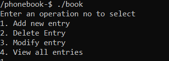
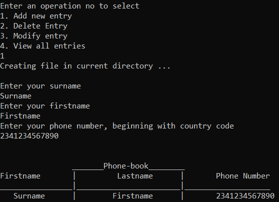
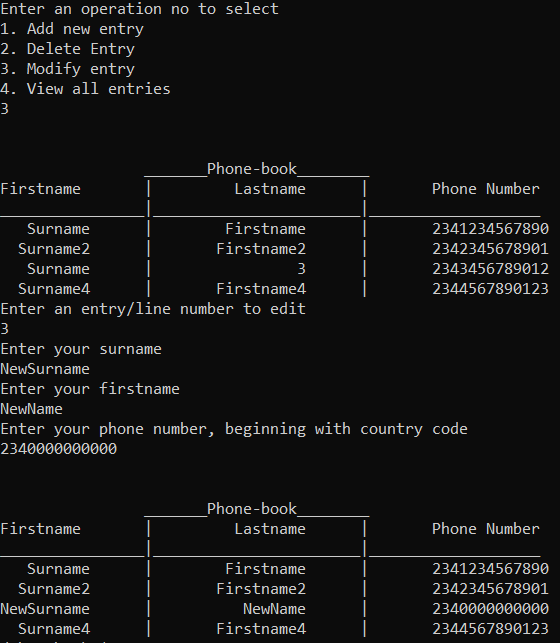
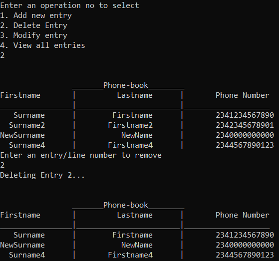
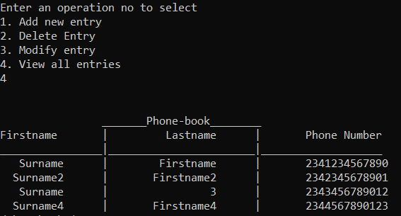

# Phonebook
A program for adding, deleting, editing, storing and viewing data in an ordered manner

### Compilation and Running
#### Compilation
```commandline
$- ./compile.sh
```

If an error occurs or your architecture is not supported, please compile with:
```commandline
$- gcc phone.c -o book
```
- Other compilers like clang, llvm, or make should work as well

#### Running
Run the book executeable generated from compilation
```commandline
$- ./book
```
Expected Output:


--------------------------------------------------------------------------------

### Operations
#### Adding Entries
You can add a new entry to the phonebook by entering 1 at the options prompt.  
Information needed are:
- Surname (no spaces allowed in a name)
- Firstname
- Phone (with country code preceeding)



#### Modifying Entries
Information can be edited by entering 2 at the options prompt.  
It replaces the whole line and each information must be re-entered.  
Note that the first entry is counted as entry 1.  



#### Deleting Entries
An entry can be deleted by providing its line/entry number after supplying option 3 at the options prompt.  

  

#### View Entries
Entering option 4 at the prompt displays the current phonebook file if it exists.  

  
-------------------------------------------------------------------------------
